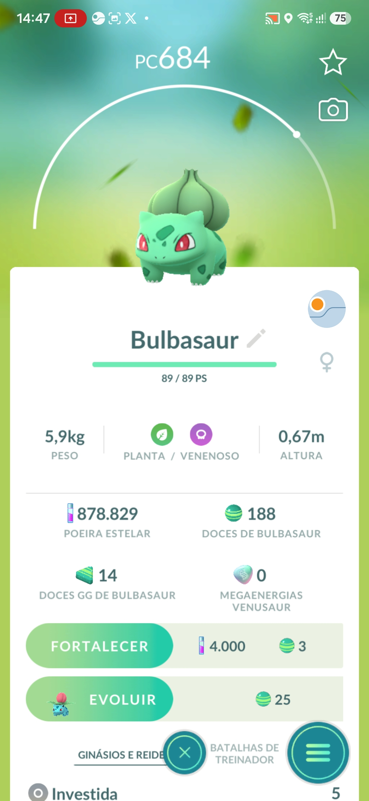
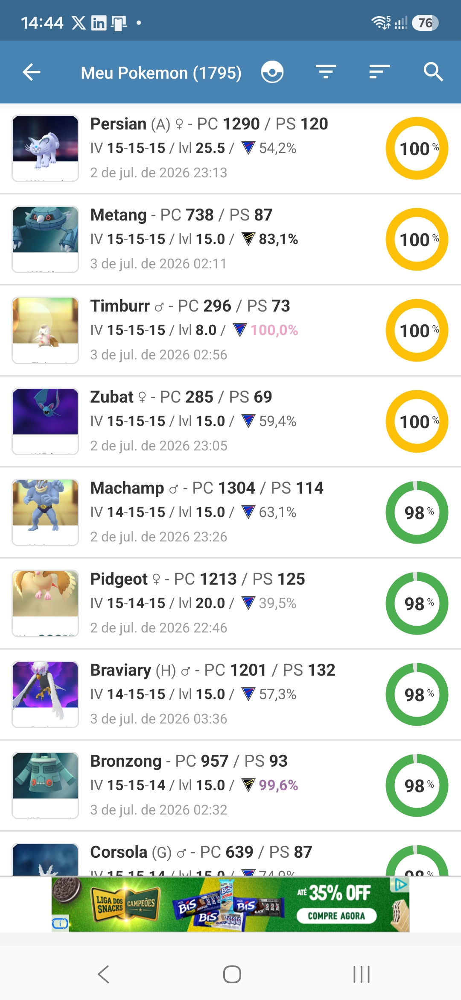

# GoPokeScan

Utilitário de PC (Windows) que extrai os dados da sua coleção de Pokémon GO
usando um celular Android conectado por **ADB Wi-Fi** — sem root, sem mexer nos
servidores do jogo e sem pagar exportação premium.

Ele trabalha em duas frentes complementares:

| Frente | O que faz | Técnica |
|---|---|---|
| **Pokémon GO** | Percorre sua coleção no jogo abrindo a avaliação de cada Pokémon e tirando um print numerado por ciclo | Visão computacional (OpenCV): template matching + detecção por cor, com **gestos humanizados** (jitter, duração variável) |
| **PokéGenie** | Raspa a lista "Meus Pokemons" do app PokéGenie e gera um **CSV** com IV, rankings PvP (Grande Liga / Ultra Liga / Copinha), evolução-alvo, PC-alvo, poeira e moveset | Árvore de UI (`uiautomator dump`): lê o **texto real** dos elementos — zero OCR, zero template, independente da resolução da tela |

## Como funciona a raspagem do PokéGenie

1. Você escaneia seus Pokémon no PokéGenie normalmente (pela sobreposição do app).
2. Na GUI do GoPokeScan, marque os filtros desejados — `IV (PvE)`, `Grande Liga`,
   `Ultra Liga`, `Copinha` — e clique em **▶ POKEGENIE**.
3. Para cada filtro, o programa reordena a lista no app, rola até o fim lendo a
   árvore de UI de cada tela, deduplica as sobreposições e valida a contagem
   contra o total do app ("Meu Pokemon (N)").
4. Sai um **CSV em formato largo** (uma linha por Pokémon) em `pokescan/app/exports/`:

```
Especie, Forma, Genero, PC, PS, IV, Level,
IV_pct, Moveset, Move_Rank,
GL_rank, GL_evol, GL_pc_alvo, GL_poeira,
UL_rank, UL_evol, UL_pc_alvo, UL_poeira,
LC_rank, LC_evol, LC_pc_alvo, LC_poeira
```

- A chave de identidade entre filtros é `Especie+Forma+Genero+PC+PS+IV+Level`.
- Abortar no meio gera um CSV **`_parcial`** com o que já foi coletado.
- A volta ao topo entre filtros usa "modo rápido" (replay das rolagens da descida
  com fling), cortando minutos em coleções grandes.

## Instalação

Requisitos: **Windows**, **Python 3.10+**, **Android platform-tools** (`adb`)
e um celular Android com *Depuração sem fio* ativada.

```bat
cd pokescan
setup.bat   :: cria a .venv e instala as dependencias (+ Tesseract p/ calibracao)
run.bat     :: abre a GUI
```

Na GUI:
1. **Configurações ⚙** → informe o caminho do `adb.exe`, IP e porta do celular
   (e o pareamento na primeira vez). O app fixa a porta 5555 e memoriza a rede.
2. Para a frente Pokémon GO: rode **Calibrar Tela de Jogo** e **Calibrar Swipe
   Horizontal** uma vez por aparelho (telas certas abaixo).
3. Para a frente PokéGenie: **nenhuma calibração é necessária**.

## Em qual tela deixar o celular

| Pokémon GO — calibrar e iniciar | PokéGenie — raspar |
|:---:|:---:|
|  |  |

**Pokémon GO** — deixe o jogo na tela de informações do **primeiro Pokémon da
coleção**, com a bolinha do PokéGenie (sobreposição) posicionada sobre o card
branco, como na imagem — o fundo branco é o que permite detectá-la direito.

- **Calibrar Tela de Jogo**: rode com o celular exatamente nessa tela.
- **Calibrar Swipe Horizontal**: na mesma tela, grave os gestos deslizando de
  um Pokémon para o outro na região do nome/boneco.
- **▶ POKEMON GO**: a varredura também deve começar dessa tela, no primeiro
  Pokémon.

**PokéGenie** — abra o app na lista **"Meus Pokemons"** (imagem da direita).
Sem calibração: marcou os filtros, deu **▶ POKEGENIE**, começou.

## Privacidade

O `.gitignore` deste repositório **exclui todos os dados pessoais** gerados
pelo uso: os CSVs exportados, os prints da sua coleção (`capturas/`), a
configuração local com IP (`config.json`), os perfis de rede com o SSID do seu
Wi-Fi (`redes.json`) e os templates de calibração da sua tela. O que sobe é só
código.

## Avisos

- **Use por sua conta e risco.** Automatizar interações com o Pokémon GO viola
  os Termos de Serviço da Niantic e pode resultar em suspensão ou banimento da
  conta. Os gestos humanizados reduzem, mas não eliminam, esse risco.
- A frente PokéGenie apenas lê, no seu próprio aparelho, dados que o app já
  exibe na tela — mas o formato da interface pode mudar a qualquer atualização
  do PokéGenie e exigir ajuste dos parsers.
- Projeto sem qualquer afiliação com Niantic, The Pokémon Company ou PokéGenie.

## Documentação técnica

Estrutura de pastas, módulos e detalhes de cada camada: [pokescan/README.md](pokescan/README.md).
